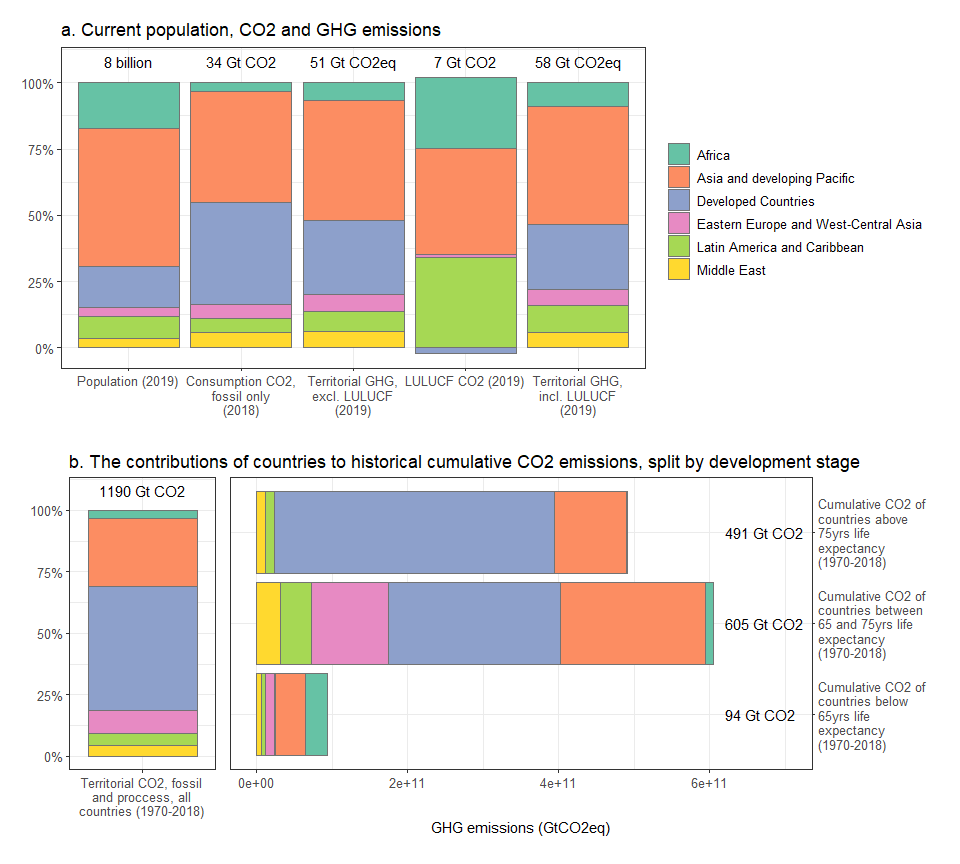

```r
data <- gather_data("region_ar6_6",ipcc_regions,edgar_ghg,land,wdi_data_gdp_pop)

# p1 <- data %>%
#   filter(category=="Current population and emissions") %>% 
#   filter(var!="Territorial CO2, fossil and proccess (2019)") %>% 
#   ggplot(.,aes(x=var,y=fraction,fill=region_select)) +
#   geom_bar(stat='identity',color="#737373") +
#   geom_text(data=data %>% 
#               filter(var!="Territorial CO2, fossil and proccess (2019)") %>% 
#               filter(category=="Current population and emissions") %>% 
#               filter(region_select=="Africa"),aes(x=var,y=1.08,label=label)) +
#   scale_fill_brewer(palette="Set2") +
#   scale_x_discrete(labels=label_wrap_gen(width=18,multi_line = TRUE)) +
#   scale_y_continuous(labels = percent,breaks=c(0,0.25,0.50,0.75,1)) +
#   #facet_wrap(.~category,scales="free",nrow=2) +
#   ggtitle("a. Current population, CO2 and GHG emissions") +
#   theme(legend.title=element_blank(),
#         axis.title = element_blank(),
#         title = element_text(face="plain"),
#         axis.text = element_text(size=10),
#         legend.text = element_text(size=10))
#   
# p2 <- data %>% 
#   filter(category=="Historical cumulative emissions") %>% 
#   ggplot(.,aes(x=var,y=fraction,fill=region_select)) +
#   geom_bar(stat='identity',color="#737373") +
#   geom_text(data=data %>% 
#               filter(category=="Historical cumulative emissions") %>% 
#               filter(region_select=="Africa"),aes(x=var,y=1.08,label=label)) +
#   scale_fill_brewer(palette="Set2") +
#   scale_x_discrete(labels=label_wrap_gen(width=18,multi_line = TRUE)) +
#   scale_y_continuous(labels = percent,breaks=c(0,0.25,0.50,0.75,1)) +
#   #facet_wrap(.~category,scales="free",nrow=2) +
#   ggtitle("b. Historical cumulative CO2 emissions, at different development stages") +
#   theme(legend.title=element_blank(),
#         axis.title = element_blank(),
#         title = element_text(face="plain"),
#         axis.text = element_text(size=10),
#         legend.text = element_text(size=10))
# 
# p1 / p2
```


```r
p1 <- data %>%
  filter(category=="Current population and emissions") %>% 
  filter(var!="Territorial CO2, fossil and proccess (2019)") %>% 
  ggplot(.,aes(x=var,y=fraction,fill=region_select)) +
  geom_bar(stat='identity',color="#737373") +
  geom_text(data=data %>% 
              filter(var!="Territorial CO2, fossil and proccess (2019)") %>% 
              filter(category=="Current population and emissions") %>% 
              filter(region_select=="Africa"),aes(x=var,y=1.08,label=label)) +
  scale_fill_brewer(palette="Set2") +
  scale_x_discrete(labels=label_wrap_gen(width=18,multi_line = TRUE)) +
  scale_y_continuous(labels = percent,breaks=c(0,0.25,0.50,0.75,1)) +
  #facet_wrap(.~category,scales="free",nrow=2) +
  ggtitle("a. Current population, CO2 and GHG emissions") +
  theme(legend.title=element_blank(),
        axis.title = element_blank(),
        title = element_text(face="plain"),
        axis.text = element_text(size=10),
        legend.text = element_text(size=10))
  
p2 <- data %>% 
  filter(var=="Territorial CO2, fossil and proccess, all countries (1970-2018)") %>% 
  ggplot(.,aes(x=var,y=fraction,fill=region_select)) +
  geom_bar(stat='identity',color="#737373") +
  geom_text(data=data %>% 
              filter(category=="Historical cumulative emissions") %>% 
              filter(var=="Territorial CO2, fossil and proccess, all countries (1970-2018)") %>% 
              filter(region_select=="Africa"),aes(x=var,y=1.08,label=label)) +
  scale_fill_brewer(palette="Set2") +
  scale_x_discrete(labels=label_wrap_gen(width=25,multi_line = TRUE)) +
  scale_y_continuous(labels = percent,breaks=c(0,0.25,0.50,0.75,1)) +
  #facet_wrap(.~category,scales="free",nrow=2) +
  ggtitle("b. The contributions of countries to historical cumulative CO2 emissions, split by development stage") +
  theme(legend.position="none",
        axis.title = element_blank(),
        title = element_text(face="plain"),
        axis.text = element_text(size=10),
        legend.text = element_text(size=10))

p3 <- data %>% 
  filter(category=="Historical cumulative emissions") %>% 
  filter(var!="Territorial CO2, fossil and proccess, all countries (1970-2018)") %>% 
  filter(var!="LULUCF CO2, all countries (1850-2019)") %>% 
  ggplot(.,aes(x=reorder(var,desc(var)),y=value,fill=region_select)) +
  geom_bar(stat='identity',color="#737373") +
  geom_text(data=data %>% 
              filter(category=="Historical cumulative emissions") %>% 
              filter(var!="Territorial CO2, fossil and proccess, all countries (1970-2018)") %>% 
              filter(var!="LULUCF CO2, all countries (1850-2019)") %>% 
              filter(region_select=="Africa"),aes(x=var,y=6.2e11,label=label),hjust=0) +
  scale_fill_brewer(palette="Set2") +
  coord_flip() +
  scale_x_discrete(labels=label_wrap_gen(width=18,multi_line = TRUE),position="top",) +
  expand_limits(y=c(0,7e11)) +
  ylab("GHG emissions (GtCO2eq)") +
  theme(legend.position="none",
        axis.title.y = element_blank(),
        title = element_text(face="plain"),
        axis.text = element_text(size=10),
        legend.text = element_text(size=10),
        plot.background = element_blank())


wrap_elements(p1) / wrap_elements((p2 + p3 + plot_layout(widths=c(1,4))))
```

<!-- -->


```r
wb <- openxlsx::createWorkbook(title = "ipcc_ar6_figure_equity_perspectives")

addWorksheet(wb,"info")
addWorksheet(wb,"data")

data <- data %>% 
  filter(var!="LULUCF CO2, all countries (1850-2019)")

info = data.frame(x=c("Author","Last update","Code"),y=c("William F. Lamb",as.character(Sys.time()),"https://github.com/mcc-apsis/AR6-Emissions-trends-and-drivers/blob/master/R/Analysis%20and%20figures/equity_perspectives.Rmd"))

writeData(wb, sheet="info",info,colNames=F,rowNames=F)
writeData(wb, sheet = "data", data, colNames = T, rowNames = F)

saveWorkbook(wb,"../../Results/Plot data/ipcc_ar6_figure_equity_perspectives.xlsx",overwrite=T)
```

Note that the `echo = FALSE` parameter was added to the code chunk to prevent printing of the R code that generated the plot.
