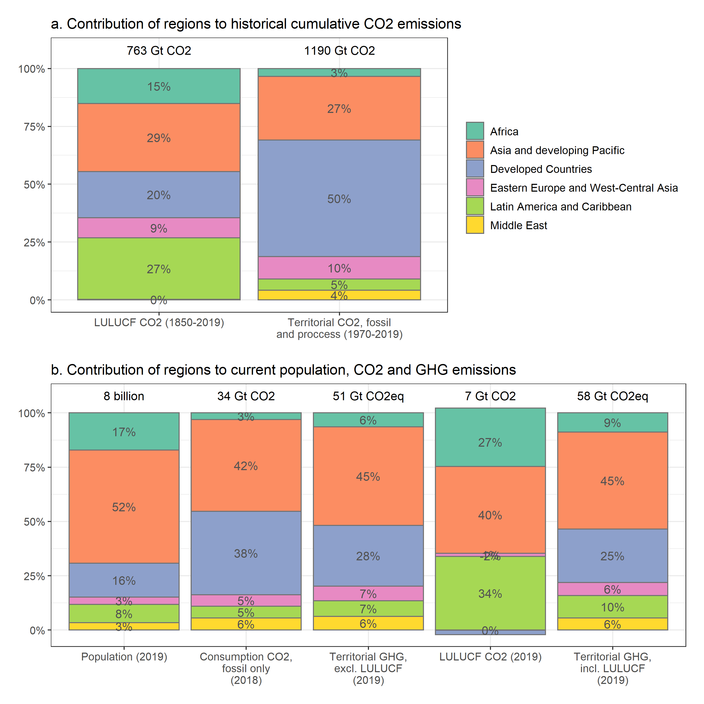

```r
data <- gather_data("region_ar6_6",ipcc_regions,edgar_ghg,land,wdi_data_gdp_pop)


p1 <- data %>% 
  filter(category=="Current population and emissions") %>% 
  ggplot(.,aes(x=var,y=fraction,fill=region_select)) +
  geom_bar(stat='identity',color="#737373") +
  geom_text(data=data %>% 
              filter(category=="Current population and emissions") %>% 
              filter(region_select=="Africa"),aes(x=var,y=1.08,label=label)) +
  scale_fill_brewer(palette="Set2") +
  scale_x_discrete(labels=label_wrap_gen(width=18,multi_line = TRUE)) +
  scale_y_continuous(labels = percent,breaks=c(0,0.25,0.50,0.75,1)) +
  #facet_wrap(.~category,scales="free",nrow=2) +
  ggtitle("a. Current population, CO2 and GHG emissions") +
  theme(legend.title=element_blank(),
        axis.title = element_blank(),
        title = element_text(face="plain"),
        axis.text = element_text(size=10),
        legend.text = element_text(size=10))
  
p2 <- data %>% 
  filter(category=="Historical cumulative emissions") %>% 
  ggplot(.,aes(x=var,y=fraction,fill=region_select)) +
  geom_bar(stat='identity',color="#737373") +
  geom_text(data=data %>% 
              filter(category=="Historical cumulative emissions") %>% 
              filter(region_select=="Africa"),aes(x=var,y=1.08,label=label)) +
  scale_fill_brewer(palette="Set2") +
  scale_x_discrete(labels=label_wrap_gen(width=18,multi_line = TRUE)) +
  scale_y_continuous(labels = percent,breaks=c(0,0.25,0.50,0.75,1)) +
  #facet_wrap(.~category,scales="free",nrow=2) +
  ggtitle("b. Historical cumulative CO2 emissions, at different development stages") +
  theme(legend.title=element_blank(),
        axis.title = element_blank(),
        title = element_text(face="plain"),
        axis.text = element_text(size=10),
        legend.text = element_text(size=10))

p1 / p2
```

<!-- -->


```r
# data <- gather_data("region_ar6_10",ipcc_regions,edgar_ghg,land,wdi_data_gdp_pop)
# 
# data %>% ggplot(.,aes(x=var,y=fraction,fill=region_select)) +
#   geom_bar(stat='identity',color="#737373") +
#   scale_fill_manual(values=colorRampPalette(brewer.pal(8, "Set2"))(10)) +
#   scale_x_discrete(labels=label_wrap_gen(width=15,multi_line = TRUE)) +
#   scale_y_continuous(labels = percent) +
#   theme(legend.title=element_blank(),
#         axis.title = element_blank()) +
#   ggtitle("Different perspectives on emissions, equity and responsibility")
```

Note that the `echo = FALSE` parameter was added to the code chunk to prevent printing of the R code that generated the plot.
