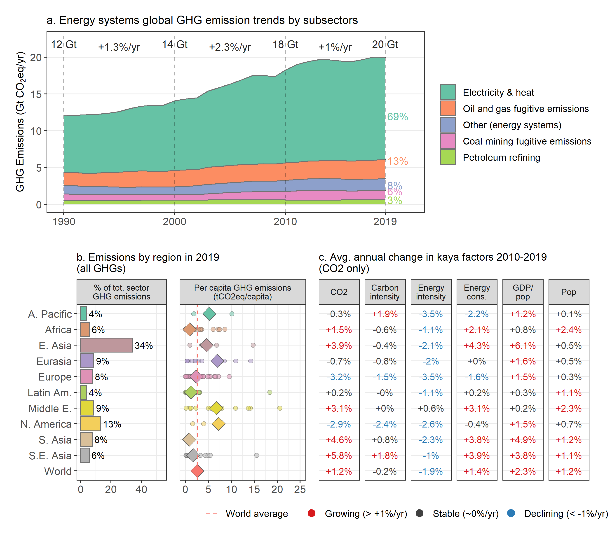

# Setup

# Data preparation
## Total sector & subsector trend

## % of sector emissions in each region

## Per capita sector emissions by region

## Kaya analysis

## Kaya analysis AFOLU

# Figures
## Trend figure

## Fraction figure

## Per capita figure

## Kaya figure

# Results
## AFOLU

<!-- -->

## Energy systems

<!-- -->

## Industry

<!-- -->

## Buildings

<!-- -->

## Transport

<!-- -->

## Total

<!-- -->
