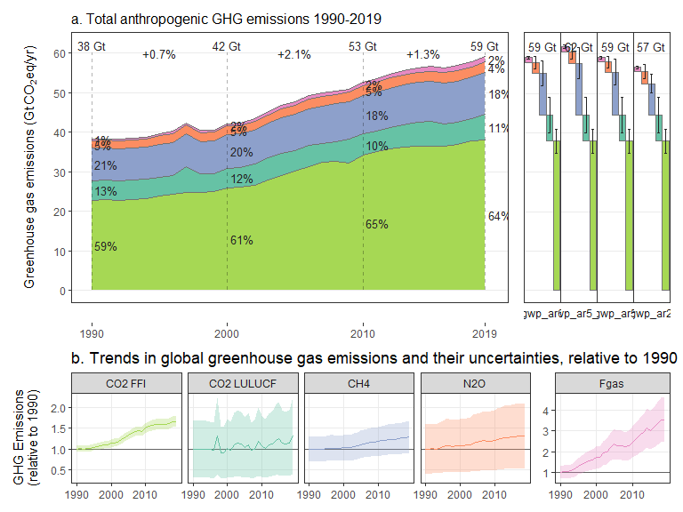
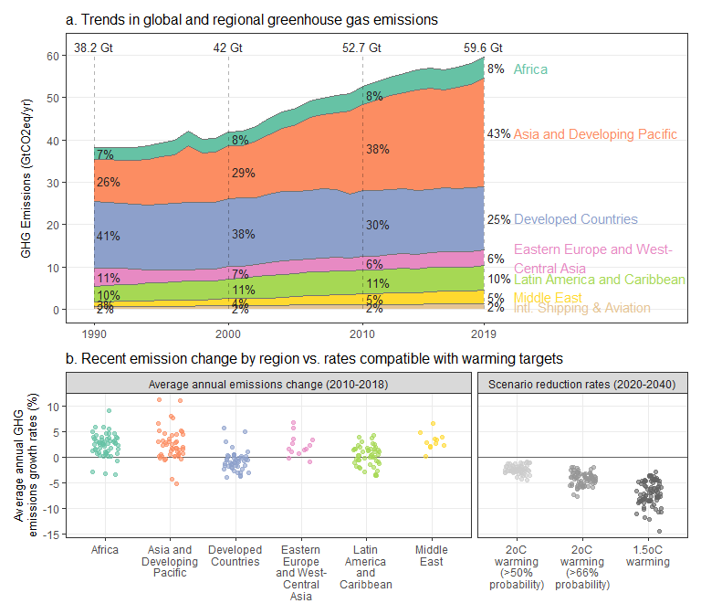
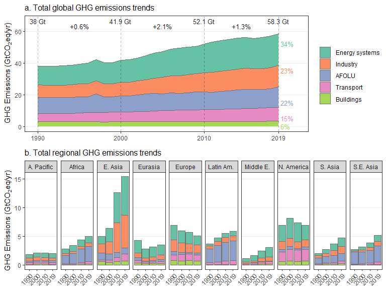
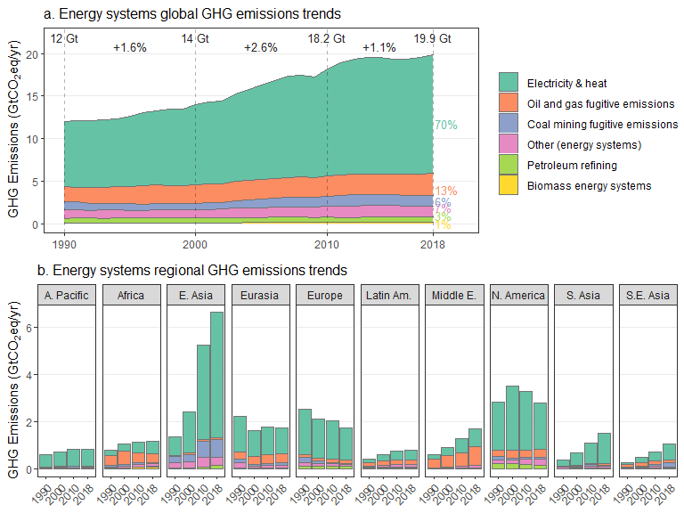
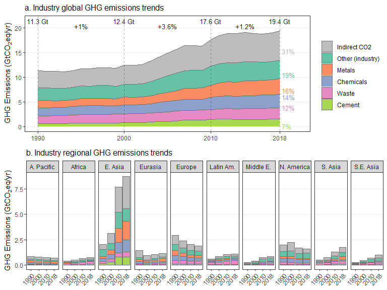
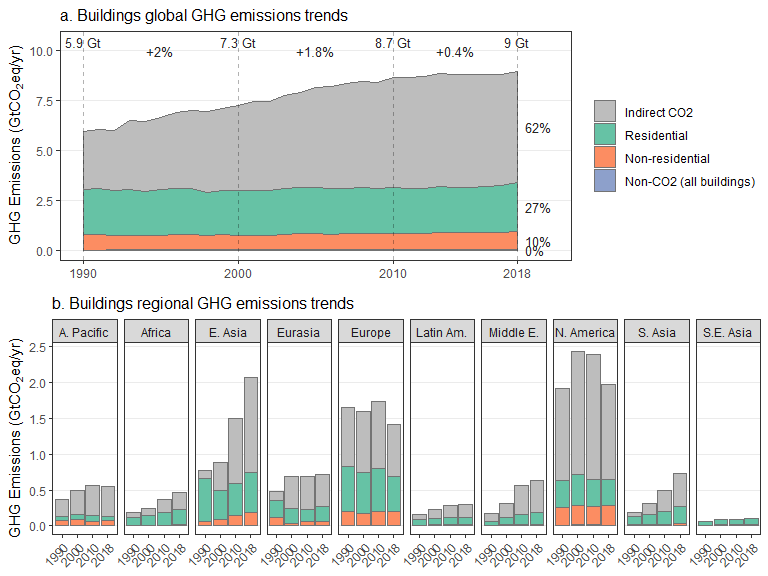
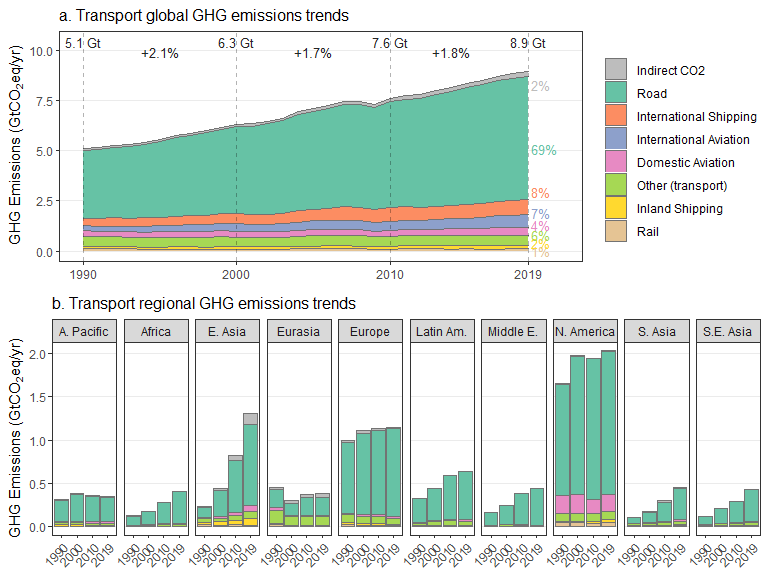

<style type="text/css">

body {
	width: 800px;
	margin: auto;
}

html {
  font-size: 14px;
}

.chart-title {  /* chart_title  */
  font-size: 16px;

.figure-title {  /* figure_title  */
  color: red;
  font-size: 20px;


</style>


```{r setup, include=FALSE}

rm(list = ls())
library(flexdashboard)
library(tidyverse)
library(knitr)
library(kableExtra)
library(openxlsx)

captions <- read.xlsx('Results/Plots/captions.xlsx')
load("Data/rates.RData")
rates <- gather(rates,blarg,values,`1990`:`1990-2019`)
rates <- rates %>% 
  mutate(values=round(values,2))
rates$blarg <- as.factor(rates$blarg)
rates$blarg <- factor(rates$blarg,levels=levels(rates$blarg)[c(1,4,6,8,2,5,7,3)])
rates <- spread(rates,blarg,values)

```

Global emissions trends
=====================================

### Welcome

This webpage summarises recent trends in global, regional and sectoral greenhouse gas emissions. This analysis has been developed for the Intergovernmental Panel on Climate Change (IPCC) 6th Assessment (AR6), Working Group (WG) III Report. Here you can find the emissions trend figures depicted across the report, but especially in Chapter 2 (Emissions Trends and Drivers), the summary documents (Summary for Policymakers and Technical Summary), and sector chapters.

See the <a href="file:///C:/Users/lamw/Documents/SpiderOak%20Hive/Work/Projects/AR6-Emissions-trends-and-drivers/index.html#info">Info</a> tab for more information on our sources and analysis.

----------------------------------------------------------------------

### Trends in total greenhouse gas emissions by gas

```{r,out.width="80%",fig.align = 'center',results='asis'}
cat("<br>")


```
```{r,results = 'asis'}

cat("<br>")
cat("<span class='figure_title'>",captions$title[captions$plot=="gases"],"</span>")
cat("<br>")
cat(captions$caption[captions$plot=="gases"])
cat("<br>")
cat("Links: ")
cat("<a href='https://github.com/mcc-apsis/AR6-Emissions-trends-and-drivers/raw/master/Results/Plot%20data/ipcc_ar6_figure_spm1_gases.xlsx'>data</a> | 
    <a href='https://github.com/mcc-apsis/AR6-Emissions-trends-and-drivers/blob/master/R/Analysis%20and%20figures/emissions_by_gas.Rmd'>code</a> | 
    <a href='https://github.com/mcc-apsis/AR6-Emissions-trends-and-drivers/raw/master/Plots/gas_trends_spm-1.png'>download png</a>")
```


-----------------------------------------------------------------------

### Trends in total greenhouse gas emissions, by region

```{r,out.width="80%",fig.align = 'center',results='asis'}
cat("<br>")



```
```{r,results = 'asis'}
cat("<br>")
cat("<span class='figure_title'>",captions$title[captions$plot=="regions"],"</span>")
cat("<br>")
cat(captions$caption[captions$plot=="regions"])
cat("<br>")
cat("Links: ")
cat("<a href='https://github.com/mcc-apsis/AR6-Emissions-trends-and-drivers/raw/master/Results/Plot%20data/ipcc_ar6_figure_spm2_regions.xlsx'>data</a> | 
    <a href='https://github.com/mcc-apsis/AR6-Emissions-trends-and-drivers/blob/master/R/Analysis%20and%20figures/emissions_by_region.Rmd'>code</a> | 
    <a href='https://github.com/mcc-apsis/AR6-Emissions-trends-and-drivers/raw/master/Results/Plots/region_trends_spm-2.png'>download png</a>")
```


Sector emissions trends
=====================================

### Sector emissions trends

Global greenhouse gas emissions can be attributed to five sectors: energy systems; industry; agriculture, forestry and other land use (AFOLU); buildings; and transport. Here we show the trends in each of these sectors. 

For the industry, buildings and transport sectors, we show the indirect CO2 emissions associated with electricity and heat supply. 

Most of these figures and analysis have been published in the following article, which also includes a review of the literature on trends, sector by sector:

* <a href="https://iopscience.iop.org/article/10.1088/1748-9326/abee4e">A review of trends and drivers of greenhouse gas emissions by sector from 1990 to 2018</a>

Consolidated data files are available for the figures here:

* <a href="https://github.com/mcc-apsis/AR6-Emissions-trends-and-drivers/raw/master/Results/Plot%20data/ipcc_ar6_figure_sectors.xlsx">Emissions by sector</a>

These figures are up to date for EDGAR v6, but we do not yet have IEA indirect emissions data for 2019, hence the 2018 cutoff date.

-----------------------------------------------------------------------
### All sectors - regional trends


```{r,out.width="80%",fig.align = 'center',results='asis'}
cat("<br>")


```
```{r,results = 'asis'}
cat("<br>")
cat("<span class='figure_title'>",captions$title[captions$plot=="sectors_total"],"</span>")
cat("<br>")
cat(captions$caption[captions$plot=="sectors_total"])
cat("<br>")
cat("Links: ")
cat("<a href='https://raw.githubusercontent.com/mcc-apsis/AR6-Emissions-trends-and-drivers/master/Results/Plots/Sectors/totals-1.png'>download png</a>")
```


-----------------------------------------------------------------------
### Energy sector - regional trends


```{r,out.width="80%",fig.align = 'center',results='asis'}
cat("<br>")


```
```{r,results = 'asis'}
cat("<br>")
cat("<span class='figure_title'>",captions$title[captions$plot=="sectors_energy"],"</span>")
cat("<br>")
cat(captions$caption[captions$plot=="sectors_energy"])
cat("<br>")
cat("Links: ")
cat("<a href='https://raw.githubusercontent.com/mcc-apsis/AR6-Emissions-trends-and-drivers/master/Results/Plots/Sectors/energy-1.png'>download png</a>")
```


-----------------------------------------------------------------------
### Industry sector - regional trends


```{r,out.width="80%",fig.align = 'center',results='asis'}
cat("<br>")


```
```{r,results = 'asis'}
cat("<br>")
cat("<span class='figure_title'>",captions$title[captions$plot=="sectors_industry"],"</span>")
cat("<br>")
cat(captions$caption[captions$plot=="sectors_industry"])
cat("<br>")
cat("Links: ")
cat("<a href='https://raw.githubusercontent.com/mcc-apsis/AR6-Emissions-trends-and-drivers/master/Results/Plots/Sectors/industry-1.png'>download png</a>")
```


-----------------------------------------------------------------------
### Building sector - regional trends


```{r,out.width="80%",fig.align = 'center',results='asis'}
cat("<br>")


```
```{r,results = 'asis'}
cat("<br>")
cat("<span class='figure_title'>",captions$title[captions$plot=="sectors_buildings"],"</span>")
cat("<br>")
cat(captions$caption[captions$plot=="sectors_buildings"])
cat("<br>")
cat("Links: ")
cat("<a href='https://raw.githubusercontent.com/mcc-apsis/AR6-Emissions-trends-and-drivers/master/Results/Plots/Sectors/buildings-1.png'>download png</a>")
```


-----------------------------------------------------------------------
### Transport sector - regional trends


```{r,out.width="80%",fig.align = 'center',results='asis'}
cat("<br>")


```
```{r,results = 'asis'}
cat("<br>")
cat("<span class='figure_title'>",captions$title[captions$plot=="sectors_transport"],"</span>")
cat("<br>")
cat(captions$caption[captions$plot=="sectors_transport"])
cat("<br>")
cat("Links: ")
cat("<a href='https://raw.githubusercontent.com/mcc-apsis/AR6-Emissions-trends-and-drivers/master/Results/Plots/Sectors/transport-1.png'>download png</a>")
```


-----------------------------------------------------------------------
### AFOLU sector - regional trends


```{r,out.width="80%",fig.align = 'center',results='asis'}
cat("<br>")
include_graphics("Results/Plots/Sectors/afolu-1.png")

```
```{r,results = 'asis'}
cat("<br>")
cat("<span class='figure_title'>",captions$title[captions$plot=="sectors_afolu"],"</span>")
cat("<br>")
cat(captions$caption[captions$plot=="sectors_afolu"])
cat("<br>")
cat("Links: ")
cat("<a href='https://raw.githubusercontent.com/mcc-apsis/AR6-Emissions-trends-and-drivers/master/Results/Plots/Sectors/AFOLU-1.png'>download png</a>")
```


Growth rates
=====================================


### Growth rates

Here we have compiled growth rate estimations for gases, regions, sectors, subsectors and countries. We use the simple compound average growth rate calculation:

r = (E(t+n)/E(t))^(1/t) - 1

where E is the emissions value in a given year t. Following the Global Carbon Project convention (Friedlingstein et al. 2019), we apply an adjustment for leap years, where E = E*(365/366) in leap years. This is why the totals here for 2000 (a leap year) are slightly different from the raw data.

The code for producing these tables is here: <a href="https://github.com/mcc-apsis/AR6-Emissions-trends-and-drivers/blob/master/R/Analysis%20and%20figures/growth_rates.Rmd">link</a>

A spreadsheet is also available: <a href="https://github.com/mcc-apsis/AR6-Emissions-trends-and-drivers/raw/master/Results/Public%20data/ipcc_ar6_data_growth_rates.xlsx">link</a>


-----------------------------------------------------------------------
### Gases


```{r,out.width="100%"}


rates %>% 
  filter(category=="Gases") %>%
  select(Gas=var,-category,-subcategory,`1990`:`1990-2019`) %>% 
  kbl() %>% 
  add_header_above(c("","Emissions (GtCO2eq)"=4,"Growth rate (%/yr)"=4)) %>% 
  kable_styling(bootstrap_options = c("striped"))

```

-----------------------------------------------------------------------
### Regions (IPCC 6 Regions)


```{r}


rates %>% 
  filter(category=="Regions") %>%
  select(-category,-subcategory,Region=var,`1990`:`1990-2019`) %>% 
  kbl() %>% 
  add_header_above(c("","Emissions (GtCO2eq)"=4,"Growth rate (%/yr)"=4)) %>% 
  kable_styling(bootstrap_options = c("striped")) %>%
  scroll_box(width = "100%", height = "400px")


```

-----------------------------------------------------------------------
### Sectors

```{r}


rates %>% 
  filter(category=="Sectors") %>%
  select(-category,-subcategory,Sector=var,`1990`:`1990-2019`) %>% 
  kbl() %>% 
  add_header_above(c("","Emissions (GtCO2eq)"=4,"Growth rate (%/yr)"=4)) %>% 
  kable_styling(bootstrap_options = c("striped"))


```

-----------------------------------------------------------------------
### Subsectors

```{r}


rates %>% 
  filter(category=="Subsectors") %>%
  select(-category,Sector=subcategory,Subsector=var,`1990`:`1990-2019`) %>% 
  arrange(Sector,desc(`2019`)) %>% 
  kbl() %>% 
  add_header_above(c("","","Emissions (MtCO2eq)"=4,"Growth rate (%/yr)"=4)) %>% 
  kable_styling(bootstrap_options = c("striped")) %>%
  scroll_box(width = "100%", height = "400px")


```

-----------------------------------------------------------------------
### Countries

```{r}


rates %>% 
  filter(category=="Countries") %>%
  select(-category,-subcategory,Country=var,`1990`:`1990-2019`) %>%
  arrange(Country) %>% 
  kbl() %>% 
  add_header_above(c("","Emissions (MtCO2eq)"=4,"Growth rate (%/yr)"=4)) %>% 
  kable_styling(bootstrap_options = c("striped")) %>%
  scroll_box(width = "100%", height = "400px")


```


Decarbonising countries
=====================================


### Decarbonising countries

Some countries have sustained greenhouse gas (GHG) emissions reductions for at least 10 years. This is true for multiple metrics, including territorial GHG emissions, territorial CO2 emissions, consumption-based CO2 emissions, and territorial GHG emissions including LULUCF CO2.

As shown in the individual plots by country, most reductions were made in the electricity and heat sub-sector. Some countries have been reducing for several decades, others in the past 10 years only.

Please note: this analysis is based on EDGAR v5 and is not currently up to date.

-----------------------------------------------------------------------
### 24 countries have reduced CO2 and GHG emissions for longer than a decade

```{r,out.width="75%",fig.align = 'center',results='asis'}

#decarbonising_countries

include_graphics(paste0("Results/Plots/Decarbonising countries/all_countries_trend-1.png"))


```
```{r,results = 'asis'}
cat("<br>")
cat("Caption: ")
#cat(captions$caption[captions$plot=="regions"])
cat("<br>")
cat("Links: ")
#cat("<a href='https://github.com/mcc-apsis/AR6-Emissions-trends-and-drivers/raw/master/Results/Plot%20data/ipcc_ar6_figure_spm2_regions.xlsx'>data</a> | <a href='https://github.com/mcc-apsis/AR6-Emissions-trends-and-drivers/blob/master/R/Analysis%20and%20figures/emissions_by_sector.Rmd'>code</a> | <a href='https://github.com/mcc-apsis/AR6-Emissions-trends-and-drivers/blob/master/Results/Plots/Sectors/afolu-1.png'>download png</a>")
```


```{r,out.height="100%",fig.align = 'center',results='asis'}


load('Data/decarbonising_countries.RData')
countries <- unique(data$country)

for(i in 1:length(countries)) {
  
  link = paste0("Results/Plots/Decarbonising countries/countries/countries-", i, ".png)")
  
  cat("  \n")
  cat(paste0("  \n### ",countries[i]))
  cat("  \n")
  cat("  \n")
  #cat("  \n")
  cat(paste0("  \n)
  cat("  \n")
  cat("  \n")
  
  
}


```

Info
=====================================

### Authors

The following team compiled the emissions data from underlying sources, designed and carried out the analysis, and produced the figures:

* William F. Lamb (IPCC AR6 WGIII Ch2), Mercator Research Institute on Global Commons and Climate Change (MCC)
* Jan C. Minx (IPCC AR6 WGIII Ch2), Mercator Research Institute on Global Commons and Climate Change (MCC)
* Niklas Döbbling, Mercator Research Institute on Global Commons and Climate Change (MCC)

We gratefully acknowledge the support of the following authors: Alaa Al Khourdajie, Julia Pongratz, Robbie Andrew, Thomas Wiedmann, Monica Crippa, Jos G.J. Olivier, Jo House, Maria Figueroa, Yamina Saheb, Raphael Slade, Suzana Kahn Ribeiro, Smail Khennas, Stephane de la Rue du Can, Igor Bashmakov, Josep G. Canadell, Piers M. Forster, Diego Guizzardi, Glen P. Peters, Andy Reisinger, Matthew Rigby, Marielle Saunois, Steven J. Smith, Efisio Solazzo, Hanqin Tian, Michael Grubb


### Data sources

We use the EDGAR v6.0 database of greenhouse gas emissions, which covers all major anthropogenic emissions sources and has a time span of 1970 to 2019 (Crippa et al 2019). EDGAR includes CO2 emissions from fossil fuel combustion derived from International Energy Agency data (IEA), supplemented with CH4 and N2O emissions from forest and peat fires taken from the Global Fire Emissions Database (GFED v4.1s; Van Der Werf et al 2017).

EDGAR does not include land-use, land-use change and forestry CO2 emissions and removals (LULUCF CO2 emissions). We therefore source these separately, using the average of three global bookkeeping models (Hansis et al 2015, Houghton and Nassikas 2017, Gasser et al 2020) in a convention established by the Global Carbon Project (Friedlingstein et al 2019). These include CO2 emissions from peat burning and draining from FAO and GFED.

### Sector and region classification

We group greenhouse gas emissions sources into five sectors covering aspects of energy supply, including fossil fuel extraction, processing, transport and generation (energy systems sector), energy demand in final sectors (transport, buildings, and industry sectors), non-energy related process emissions (e.g. cement and Fgases within industry), and agriculture and LULUCF emissions (AFOLU). 27 further sub-sectors capture more detailed emissions trends.

Countries are grouped into regions following the IPCC AR6 WGIII classification based on geography and development status.

### Global warming potentials

We use global warming potentials with a time horizon of 100 years (GWP100) to compare and aggregate different greenhouse gases. We use the latest GWP100 values with climate feedbacks from IPCC AR6 Working Group I, which are confidential until the release of the report in August 2021.

### Data access

The data is published in an open access preprint, with the full detail on our sources and methods available:

* <a href="https://essd.copernicus.org/preprints/essd-2021-228/">A comprehensive dataset for global, regional and national greenhouse gas emissions by sector 1970–2019</a>

* <a href="https://zenodo.org/record/5053056">Data repository</a>

[Note: a separate file with AR6 GWP100 values is available for IPCC authors on DM]

### Differences to EDGARv5

Several changes occurred between EDGAR v5 and EDGAR v6. Methane emissions were revised down prior to 1990. Fgas emissions were substantially revised downwards. Savannah fire emissions are no longer available. The following file provides some detailed analysis on these changes in terms of totals, regions, sectors and countries: <a href="https://github.com/mcc-apsis/AR6-Emissions-trends-and-drivers/raw/master/Results/knitr/edgar6_check.docx">Link</a>
  
