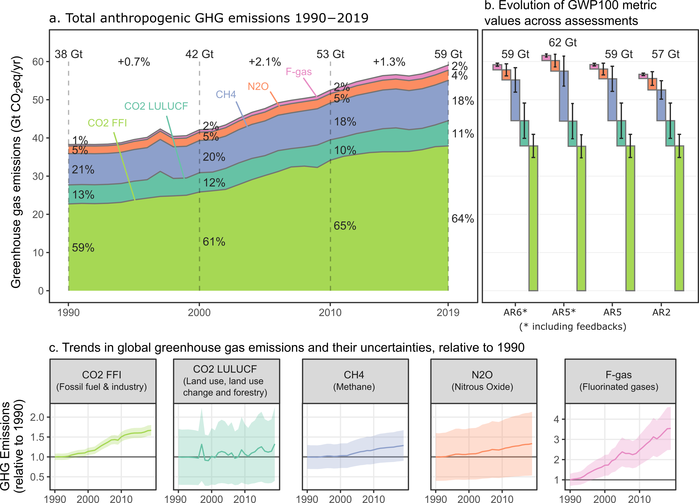
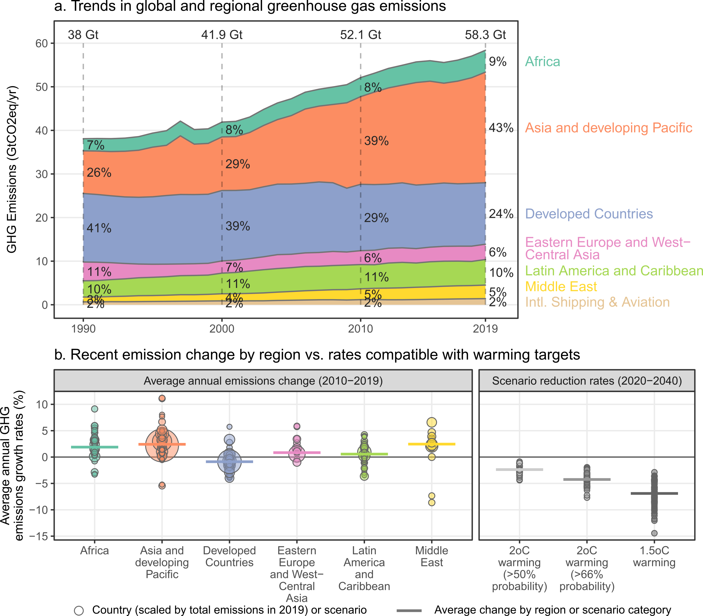
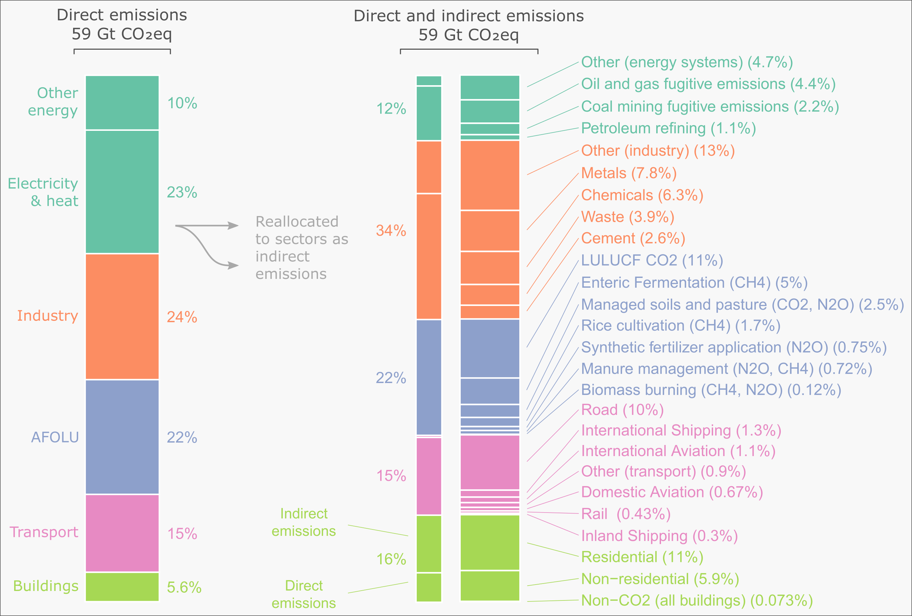
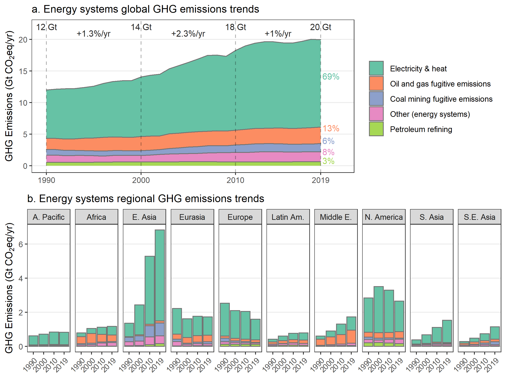
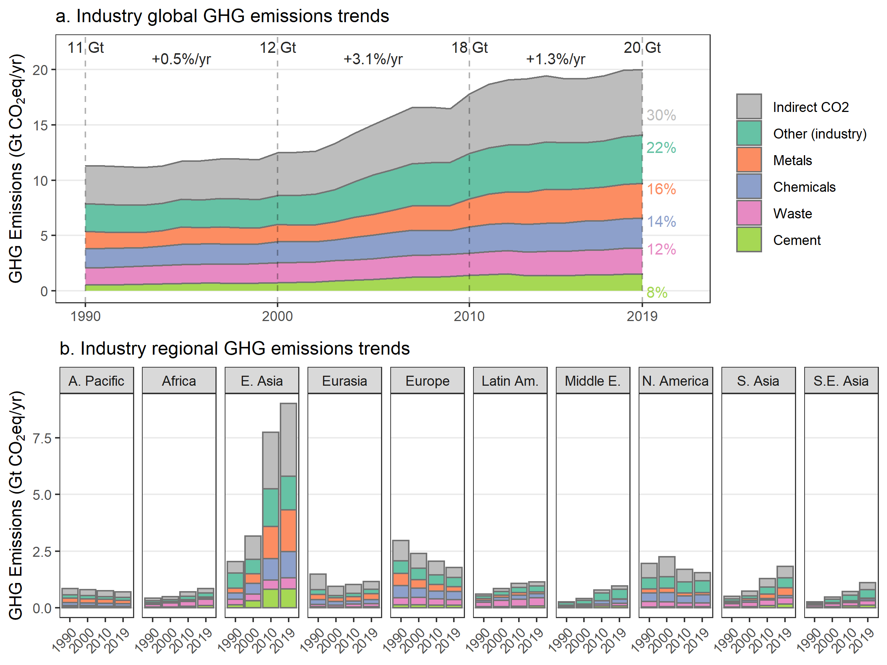
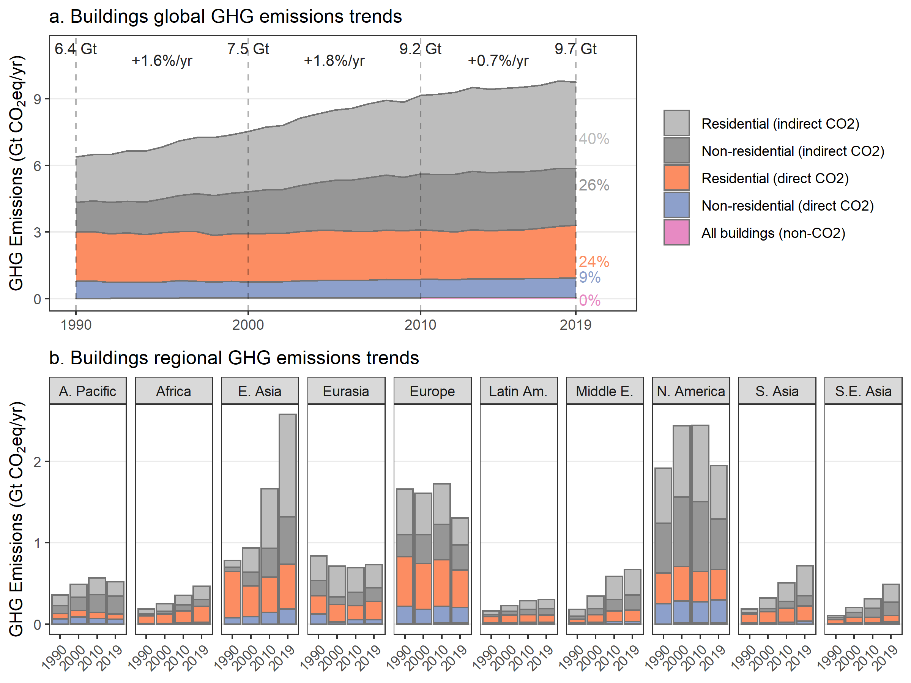
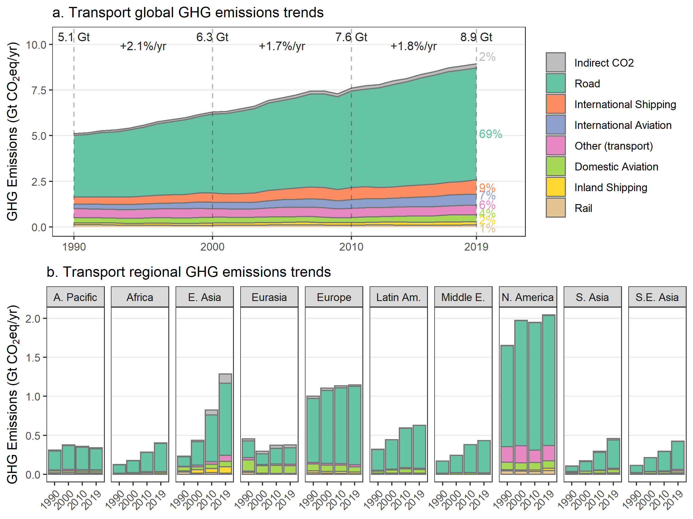
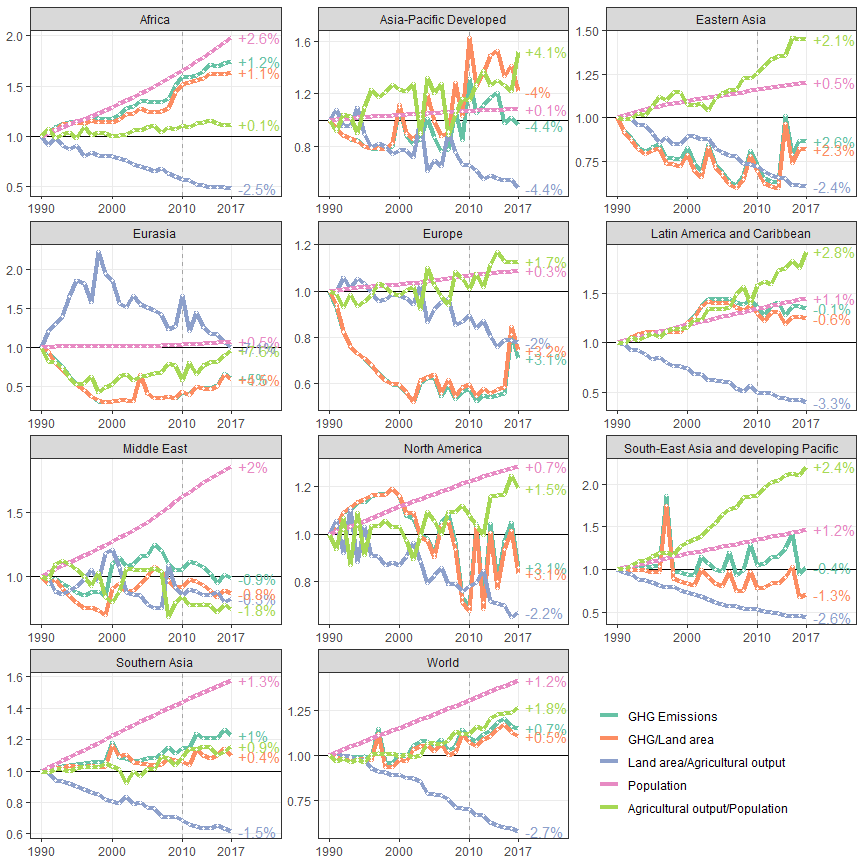

<style>

body {
	width: 800px;
	margin: auto;
}


html {
  font-size: 14px;
}

</style>


```{r setup, include=FALSE}

rm(list = ls())
library(flexdashboard)
library(tidyverse)
library(knitr)
library(openxlsx)

captions <- read.xlsx('Results/Plots/captions.xlsx')


```

Global emissions trends
=====================================

-----------------------------------------------------------------------

### Here is some text about this page


To do:

1. Add a description to the top of each page

  * links to the papers and data sources
  * info about the project and authors
  
2. Adjust the theme

  * https://pkgs.rstudio.com/flexdashboard/
  * larger headings above each figure (3rd level theme heading?)


----------------------------------------------------------------------

### Trends in total greenhouse gas emissions by gas (SPM.1)

```{r,out.width="80%",fig.align = 'center',results='asis'}
cat("<br>")


```
```{r,results = 'asis'}

cat("<br>")
cat("Caption: ")
cat(captions$caption[captions$plot=="gases"])
cat("<br>")
cat("Links: ")
cat("<a href='https://github.com/mcc-apsis/AR6-Emissions-trends-and-drivers/raw/master/Results/Plot%20data/ipcc_ar6_figure_spm1_gases.xlsx'>data</a> | 
    <a href='https://github.com/mcc-apsis/AR6-Emissions-trends-and-drivers/blob/master/R/Analysis%20and%20figures/emissions_by_gas.Rmd'>code</a> | 
    <a href='https://github.com/mcc-apsis/AR6-Emissions-trends-and-drivers/raw/master/Results/Figures/SPM_gases.png'>download png</a>")
```


-----------------------------------------------------------------------

### Trends in total greenhouse gas emissions, by region (SPM.2)

```{r,out.width="80%",fig.align = 'center',results='asis'}
cat("<br>")



```
```{r,results = 'asis'}
cat("<br>")
cat("Caption: ")
cat(captions$caption[captions$plot=="regions"])
cat("<br>")
cat("Links: ")
cat("<a href='https://github.com/mcc-apsis/AR6-Emissions-trends-and-drivers/raw/master/Results/Plot%20data/ipcc_ar6_figure_spm2_regions.xlsx'>data</a> | 
    <a href='https://github.com/mcc-apsis/AR6-Emissions-trends-and-drivers/blob/master/R/Analysis%20and%20figures/emissions_by_region.Rmd'>code</a> | 
    <a href='https://github.com/mcc-apsis/AR6-Emissions-trends-and-drivers/raw/master/Results/Figures/SPM_regions.png'>download png</a>")
```


### Emissions split by sectors with direct and indirect components (SPM.3)

```{r,out.width="80%",fig.align = 'center',results='asis'}
cat("<br>")


```
```{r,results = 'asis'}
cat("<br>")
cat("Caption: ")
cat(captions$caption[captions$plot=="direct_indirect"])
cat("<br>")
cat("Links: ")
cat("<a href='https://github.com/mcc-apsis/AR6-Emissions-trends-and-drivers/raw/master/Results/Plot%20data/ipcc_ar6_figure_spm2_regions.xlsx'>data</a> | 
    <a href='https://github.com/mcc-apsis/AR6-Emissions-trends-and-drivers/blob/master/R/Analysis%20and%20figures/direct_indirect_emissions.Rmd'>code</a> | 
    <a href='https://github.com/mcc-apsis/AR6-Emissions-trends-and-drivers/raw/master/Results/Figures/SPM_indirect_emissions.png'>download png</a>")

```


Sector emissions trends
=====================================


-----------------------------------------------------------------------

### Here is some text about this page


* Brief description
* Links to papers and data sources
* Authors and contact


-----------------------------------------------------------------------
### All sectors - regional trends


```{r,out.width="80%",fig.align = 'center',results='asis'}
cat("<br>")


```
```{r,results = 'asis'}
cat("<br>")
cat("Caption: ")
#cat(captions$caption[captions$plot=="regions"])
cat("<br>")
cat("Links: ")
cat("<a href='https://github.com/mcc-apsis/AR6-Emissions-trends-and-drivers/raw/master/Results/Plot%20data/ipcc_ar6_figure_spm2_regions.xlsx'>data</a> | 
    <a href='https://github.com/mcc-apsis/AR6-Emissions-trends-and-drivers/blob/master/R/Analysis%20and%20figures/emissions_by_sector.Rmd'>code</a> | 
    <a href='https://github.com/mcc-apsis/AR6-Emissions-trends-and-drivers/blob/master/Results/Plots/Sectors/totals-1.png'>download png</a>")
```

-----------------------------------------------------------------------
### Energy sector - regional trends


```{r,out.width="80%",fig.align = 'center',results='asis'}
cat("<br>")


```
```{r,results = 'asis'}
cat("<br>")
cat("Caption: ")
#cat(captions$caption[captions$plot=="regions"])
cat("<br>")
cat("Links: ")
cat("<a href='https://github.com/mcc-apsis/AR6-Emissions-trends-and-drivers/raw/master/Results/Plot%20data/ipcc_ar6_figure_spm2_regions.xlsx'>data</a> | 
    <a href='https://github.com/mcc-apsis/AR6-Emissions-trends-and-drivers/blob/master/R/Analysis%20and%20figures/emissions_by_sector.Rmd'>code</a> | 
    <a href='https://github.com/mcc-apsis/AR6-Emissions-trends-and-drivers/blob/master/Results/Plots/Sectors/energy-1.png'>download png</a>")
```

-----------------------------------------------------------------------
### Energy sector - per capita levels and kaya trends


```{r,out.width="80%",fig.align = 'center',results='asis'}
cat("<br>")
include_graphics("Results/Plots/Sectors/energy_summary-1.png")

```
```{r,results = 'asis'}
cat("<br>")
cat("Caption: ")
#cat(captions$caption[captions$plot=="regions"])
cat("<br>")
cat("Links: ")
cat("<a href='https://github.com/mcc-apsis/AR6-Emissions-trends-and-drivers/raw/master/Results/Plot%20data/ipcc_ar6_figure_spm2_regions.xlsx'>data</a> | 
    <a href='https://github.com/mcc-apsis/AR6-Emissions-trends-and-drivers/blob/master/R/Analysis%20and%20figures/emissions_by_sector.Rmd'>code</a> | 
    <a href='https://github.com/mcc-apsis/AR6-Emissions-trends-and-drivers/blob/master/Results/Plots/Sectors/energy-1.png'>download png</a>")
```

-----------------------------------------------------------------------
### Energy sector - kaya trends


```{r,out.width="80%",fig.align = 'center',results='asis'}
cat("<br>")
include_graphics("Results/Plots/Kaya/energy_systems_10-1.png")

```
```{r,results = 'asis'}
cat("<br>")
cat("Caption: ")
#cat(captions$caption[captions$plot=="regions"])
cat("<br>")
cat("Links: ")
cat("<a href='https://github.com/mcc-apsis/AR6-Emissions-trends-and-drivers/raw/master/Results/Plot%20data/ipcc_ar6_figure_spm2_regions.xlsx'>data</a> | 
    <a href='https://github.com/mcc-apsis/AR6-Emissions-trends-and-drivers/blob/master/R/Analysis%20and%20figures/emissions_by_sector.Rmd'>code</a> | 
    <a href='https://github.com/mcc-apsis/AR6-Emissions-trends-and-drivers/blob/master/Results/Plots/Sectors/energy-1.png'>download png</a>")
```


-----------------------------------------------------------------------
### Industry sector - regional trends


```{r,out.width="80%",fig.align = 'center',results='asis'}
cat("<br>")


```
```{r,results = 'asis'}
cat("<br>")
cat("Caption: ")
#cat(captions$caption[captions$plot=="regions"])
cat("<br>")
cat("Links: ")
cat("<a href='https://github.com/mcc-apsis/AR6-Emissions-trends-and-drivers/raw/master/Results/Plot%20data/ipcc_ar6_figure_spm2_regions.xlsx'>data</a> | 
    <a href='https://github.com/mcc-apsis/AR6-Emissions-trends-and-drivers/blob/master/R/Analysis%20and%20figures/emissions_by_sector.Rmd'>code</a> | 
    <a href='https://github.com/mcc-apsis/AR6-Emissions-trends-and-drivers/blob/master/Results/Plots/Sectors/industry-1.png'>download png</a>")
```


-----------------------------------------------------------------------
### Industry sector - per capita levels and kaya trends


```{r,out.width="80%",fig.align = 'center',results='asis'}
cat("<br>")
include_graphics("Results/Plots/Sectors/industry_summary-1.png")

```
```{r,results = 'asis'}
cat("<br>")
cat("Caption: ")
#cat(captions$caption[captions$plot=="regions"])
cat("<br>")
cat("Links: ")
cat("<a href='https://github.com/mcc-apsis/AR6-Emissions-trends-and-drivers/raw/master/Results/Plot%20data/ipcc_ar6_figure_spm2_regions.xlsx'>data</a> | 
    <a href='https://github.com/mcc-apsis/AR6-Emissions-trends-and-drivers/blob/master/R/Analysis%20and%20figures/emissions_by_sector.Rmd'>code</a> | 
    <a href='https://github.com/mcc-apsis/AR6-Emissions-trends-and-drivers/blob/master/Results/Plots/Sectors/energy-1.png'>download png</a>")
```


-----------------------------------------------------------------------
### Industry sector - kaya trends


```{r,out.width="80%",fig.align = 'center',results='asis'}
cat("<br>")
include_graphics("Results/Plots/Kaya/industry_10-1.png")

```
```{r,results = 'asis'}
cat("<br>")
cat("Caption: ")
#cat(captions$caption[captions$plot=="regions"])
cat("<br>")
cat("Links: ")
cat("<a href='https://github.com/mcc-apsis/AR6-Emissions-trends-and-drivers/raw/master/Results/Plot%20data/ipcc_ar6_figure_spm2_regions.xlsx'>data</a> | 
    <a href='https://github.com/mcc-apsis/AR6-Emissions-trends-and-drivers/blob/master/R/Analysis%20and%20figures/emissions_by_sector.Rmd'>code</a> | 
    <a href='https://github.com/mcc-apsis/AR6-Emissions-trends-and-drivers/blob/master/Results/Plots/Sectors/energy-1.png'>download png</a>")
```


-----------------------------------------------------------------------
### Building sector - regional trends


```{r,out.width="80%",fig.align = 'center',results='asis'}
cat("<br>")


```
```{r,results = 'asis'}
cat("<br>")
cat("Caption: ")
#cat(captions$caption[captions$plot=="regions"])
cat("<br>")
cat("Links: ")
cat("<a href='https://github.com/mcc-apsis/AR6-Emissions-trends-and-drivers/raw/master/Results/Plot%20data/ipcc_ar6_figure_spm2_regions.xlsx'>data</a> | 
    <a href='https://github.com/mcc-apsis/AR6-Emissions-trends-and-drivers/blob/master/R/Analysis%20and%20figures/emissions_by_sector.Rmd'>code</a> | 
    <a href='https://github.com/mcc-apsis/AR6-Emissions-trends-and-drivers/blob/master/Results/Plots/Sectors/buildings-1.png'>download png</a>")
```

-----------------------------------------------------------------------
### Buildings sector - per capita levels and kaya trends


```{r,out.width="80%",fig.align = 'center',results='asis'}
cat("<br>")
include_graphics("Results/Plots/Sectors/buildings_summary-1.png")

```
```{r,results = 'asis'}
cat("<br>")
cat("Caption: ")
#cat(captions$caption[captions$plot=="regions"])
cat("<br>")
cat("Links: ")
cat("<a href='https://github.com/mcc-apsis/AR6-Emissions-trends-and-drivers/raw/master/Results/Plot%20data/ipcc_ar6_figure_spm2_regions.xlsx'>data</a> | 
    <a href='https://github.com/mcc-apsis/AR6-Emissions-trends-and-drivers/blob/master/R/Analysis%20and%20figures/emissions_by_sector.Rmd'>code</a> | 
    <a href='https://github.com/mcc-apsis/AR6-Emissions-trends-and-drivers/blob/master/Results/Plots/Sectors/energy-1.png'>download png</a>")
```

-----------------------------------------------------------------------
### Buildings sector - kaya trends


```{r,out.width="80%",fig.align = 'center',results='asis'}
cat("<br>")
include_graphics("Results/Plots/Kaya/buildings_10-1.png")

```
```{r,results = 'asis'}
cat("<br>")
cat("Caption: ")
#cat(captions$caption[captions$plot=="regions"])
cat("<br>")
cat("Links: ")
cat("<a href='https://github.com/mcc-apsis/AR6-Emissions-trends-and-drivers/raw/master/Results/Plot%20data/ipcc_ar6_figure_spm2_regions.xlsx'>data</a> | 
    <a href='https://github.com/mcc-apsis/AR6-Emissions-trends-and-drivers/blob/master/R/Analysis%20and%20figures/emissions_by_sector.Rmd'>code</a> | 
    <a href='https://github.com/mcc-apsis/AR6-Emissions-trends-and-drivers/blob/master/Results/Plots/Sectors/energy-1.png'>download png</a>")
```

-----------------------------------------------------------------------
### Transport sector - regional trends


```{r,out.width="80%",fig.align = 'center',results='asis'}
cat("<br>")


```
```{r,results = 'asis'}
cat("<br>")
cat("Caption: ")
#cat(captions$caption[captions$plot=="regions"])
cat("<br>")
cat("Links: ")
cat("<a href='https://github.com/mcc-apsis/AR6-Emissions-trends-and-drivers/raw/master/Results/Plot%20data/ipcc_ar6_figure_spm2_regions.xlsx'>data</a> | 
    <a href='https://github.com/mcc-apsis/AR6-Emissions-trends-and-drivers/blob/master/R/Analysis%20and%20figures/emissions_by_sector.Rmd'>code</a> | 
    <a href='https://github.com/mcc-apsis/AR6-Emissions-trends-and-drivers/blob/master/Results/Plots/Sectors/transport-1.png'>download png</a>")
```

-----------------------------------------------------------------------
### Transport sector - per capita levels and kaya trends


```{r,out.width="80%",fig.align = 'center',results='asis'}
cat("<br>")
include_graphics("Results/Plots/Sectors/transport_summary-1.png")

```
```{r,results = 'asis'}
cat("<br>")
cat("Caption: ")
#cat(captions$caption[captions$plot=="regions"])
cat("<br>")
cat("Links: ")
cat("<a href='https://github.com/mcc-apsis/AR6-Emissions-trends-and-drivers/raw/master/Results/Plot%20data/ipcc_ar6_figure_spm2_regions.xlsx'>data</a> | 
    <a href='https://github.com/mcc-apsis/AR6-Emissions-trends-and-drivers/blob/master/R/Analysis%20and%20figures/emissions_by_sector.Rmd'>code</a> | 
    <a href='https://github.com/mcc-apsis/AR6-Emissions-trends-and-drivers/blob/master/Results/Plots/Sectors/energy-1.png'>download png</a>")
```


-----------------------------------------------------------------------
### Transport sector - kaya trends


```{r,out.width="80%",fig.align = 'center',results='asis'}
cat("<br>")
include_graphics("Results/Plots/Kaya/transport_10-1.png")

```
```{r,results = 'asis'}
cat("<br>")
cat("Caption: ")
#cat(captions$caption[captions$plot=="regions"])
cat("<br>")
cat("Links: ")
cat("<a href='https://github.com/mcc-apsis/AR6-Emissions-trends-and-drivers/raw/master/Results/Plot%20data/ipcc_ar6_figure_spm2_regions.xlsx'>data</a> | 
    <a href='https://github.com/mcc-apsis/AR6-Emissions-trends-and-drivers/blob/master/R/Analysis%20and%20figures/emissions_by_sector.Rmd'>code</a> | 
    <a href='https://github.com/mcc-apsis/AR6-Emissions-trends-and-drivers/blob/master/Results/Plots/Sectors/energy-1.png'>download png</a>")
```


-----------------------------------------------------------------------
### AFOLU sector - regional trends


```{r,out.width="80%",fig.align = 'center',results='asis'}
cat("<br>")
include_graphics("Results/Plots/Sectors/afolu-1.png")

```
```{r,results = 'asis'}
cat("<br>")
cat("Caption: ")
#cat(captions$caption[captions$plot=="regions"])
cat("<br>")
cat("Links: ")
cat("<a href='https://github.com/mcc-apsis/AR6-Emissions-trends-and-drivers/raw/master/Results/Plot%20data/ipcc_ar6_figure_spm2_regions.xlsx'>data</a> | 
    <a href='https://github.com/mcc-apsis/AR6-Emissions-trends-and-drivers/blob/master/R/Analysis%20and%20figures/emissions_by_sector.Rmd'>code</a> | 
    <a href='https://github.com/mcc-apsis/AR6-Emissions-trends-and-drivers/blob/master/Results/Plots/Sectors/afolu-1.png'>download png</a>")
```

-----------------------------------------------------------------------
### AFOLU sector - per capita levels and kaya trends


```{r,out.width="80%",fig.align = 'center',results='asis'}
cat("<br>")
include_graphics("Results/Plots/Sectors/afolu_summary-1.png")

```
```{r,results = 'asis'}
cat("<br>")
cat("Caption: ")
#cat(captions$caption[captions$plot=="regions"])
cat("<br>")
cat("Links: ")
cat("<a href='https://github.com/mcc-apsis/AR6-Emissions-trends-and-drivers/raw/master/Results/Plot%20data/ipcc_ar6_figure_spm2_regions.xlsx'>data</a> | 
    <a href='https://github.com/mcc-apsis/AR6-Emissions-trends-and-drivers/blob/master/R/Analysis%20and%20figures/emissions_by_sector.Rmd'>code</a> | 
    <a href='https://github.com/mcc-apsis/AR6-Emissions-trends-and-drivers/blob/master/Results/Plots/Sectors/energy-1.png'>download png</a>")
```


-----------------------------------------------------------------------
### AFOLU sector - kaya trends


```{r,out.width="80%",fig.align = 'center',results='asis'}
cat("<br>")


```
```{r,results = 'asis'}
cat("<br>")
cat("Caption: ")
#cat(captions$caption[captions$plot=="regions"])
cat("<br>")
cat("Links: ")
cat("<a href='https://github.com/mcc-apsis/AR6-Emissions-trends-and-drivers/raw/master/Results/Plot%20data/ipcc_ar6_figure_spm2_regions.xlsx'>data</a> | 
    <a href='https://github.com/mcc-apsis/AR6-Emissions-trends-and-drivers/blob/master/R/Analysis%20and%20figures/emissions_by_sector.Rmd'>code</a> | 
    <a href='https://github.com/mcc-apsis/AR6-Emissions-trends-and-drivers/blob/master/Results/Plots/Sectors/energy-1.png'>download png</a>")
```


Country emissions trends
=====================================


### Here is some text about this page

To do:

* Build a plot for each country and paste it here with links to the data
* Include comparison to the CRF data
* see decarbonising country tab


Decarbonising countries
=====================================


### Here is some text about this page

To do:

* Brief description
* Links to papers and data sources
* Authors and contact
* Link to a compiled version of the country emissions data
* Cant figure out how to embed links for each figure in the loop... 


-----------------------------------------------------------------------
### 24 countries have reduced CO2 and GHG emissions for longer than a decade

```{r,out.width="75%",fig.align = 'center',results='asis'}

#decarbonising_countries

include_graphics(paste0("Results/Plots/Decarbonising countries/all_countries_trend-1.png"))


```
```{r,results = 'asis'}
cat("<br>")
cat("Caption: ")
#cat(captions$caption[captions$plot=="regions"])
cat("<br>")
cat("Links: ")
#cat("<a href='https://github.com/mcc-apsis/AR6-Emissions-trends-and-drivers/raw/master/Results/Plot%20data/ipcc_ar6_figure_spm2_regions.xlsx'>data</a> | <a href='https://github.com/mcc-apsis/AR6-Emissions-trends-and-drivers/blob/master/R/Analysis%20and%20figures/emissions_by_sector.Rmd'>code</a> | <a href='https://github.com/mcc-apsis/AR6-Emissions-trends-and-drivers/blob/master/Results/Plots/Sectors/afolu-1.png'>download png</a>")
```


```{r,out.height="100%",fig.align = 'center',results='asis'}


load('Data/decarbonising_countries.RData')
countries <- unique(data$country)

for(i in 1:length(countries)) {
  
  link = paste0("Results/Plots/Decarbonising countries/countries/countries-", i, ".png)")
  
  cat("  \n")
  cat(paste0("  \n### ",countries[i]))
  cat("  \n")
  cat("  \n")
  #cat("  \n")
  cat(paste0("  \n)
  cat("  \n")
  cat("  \n")
  
  
}


```
